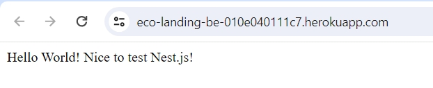
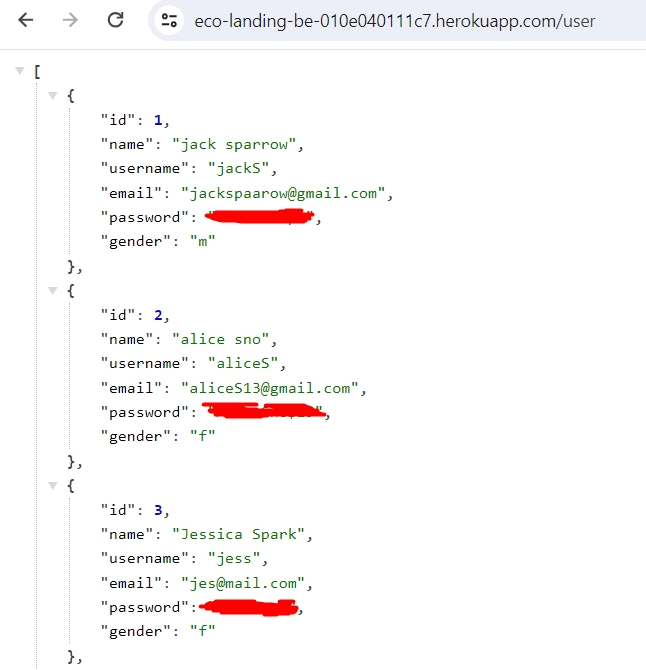
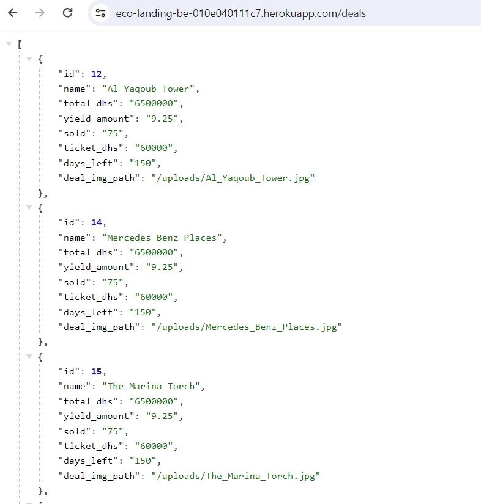
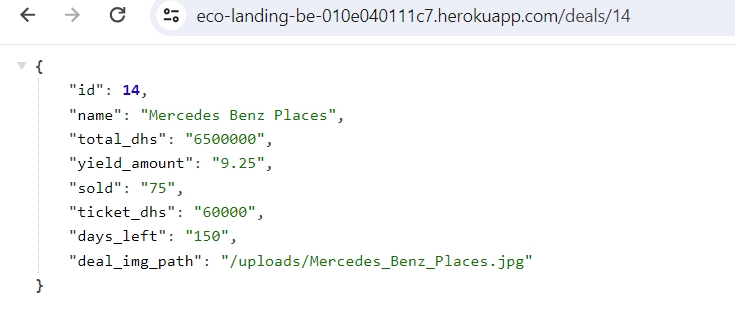

# Eco landing React App

       

This is pet project created with React, Redux plus Nest.js/Heroku backend and PostgreSQL database.

# Main page

Just to confirm this backend server works properly, i'm gonna show you response from different endpoints. On main page you'll see custom greeting:

# Users

If you open api on /user endpoint, you can see data about all users. Data is fake, but just in case passwords are blurred. You can create new user on /user +post method.

# Deals

On /deals endpoint you can see all deals and basic info about them. The hardest thing to add was image, which you should upload via form and then store somewhere and reach via correct path on frontend.

On /deal/:id you can reach info about one concrete deal.

For now this is all logic added in project and you can't reach server manually, because heroku isn't free to play.
